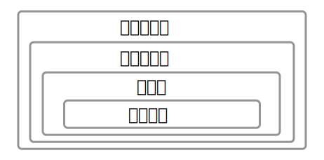

### 13.3    解析模板

大多数编程语言的两个基本行为是标记化（tokenization）（也叫扫描，scanning 或词法分析 parsing）和（语法）分析。标记化过程会以字符序列读取源代码，并从中生成标记序列。例如，在看到字符序列 `int* p = 0;` 时，“标记化器” 将生成关键字 `int`、符号 / 运算符 `*`、标识符 `p`、符号 / 运算符 `=`、整数字面值 `0` 和符号 / 运算符 `;` 构成的一系列标记描述。

然后，语法分析器将递归地吞噬标记，并将先前已找到的模式转换为更高级的构造，从而在标记序列中找到已知模式。例如，标记 `0` 是一个合法的*表达式*（expression），`*` 后随标识符 `p` 的组合是一个有效的*声明符*（declarator），而该声明符后随 ”`=`“ 再后随表示 ”`0`“ 是一个有效的*初始化声明符*（init-declarator）。最后，关键字 `int` 是一个已知的类型名，而且，当后随初始化声明符 `*p = 0` 时，将得到 `p` 的初始化声明。

#### 13.3.1    非模板的上下文敏感性

正如你可能知道或期望的，标记化比语法分析更容易。幸运的是，语法分析是一门学科，而且已经发展出了坚实的理论，许多有用的语言使用这个理论都不难解析。然而，这个理论对于*上下文无关的语言*（context-free language）最为有效，而我们已经注意到了 C++ 是上下文敏感的。为了处理这一点，C++ 编译器会将符号表与标记化器和语法分析器耦合：当解析一个声明时，它就会被加入到符号表中。当标记化器找到标识符时，就会查找表，并在找到类型时对结果标记进行标注。

例如，如果 C++ 编译器看到了

```
x*
```

标记化器就会查找 `x`。如果找到了一个类型，语法分析器就会看到

```
标识符，类型，x
符号，*
```

并得知一个声明已经开始。然而，如果没有发现 `x` 是类型，那么语法分析器就会从标记化器得到

```
标识符，非类型，x
符号，*
```

并且该构造只能作为乘法被有效解析。这些准则的细节依赖于特定实现的策略，但是大致要点应该如此。

下面的表达式展示了上下文敏感性的另一个例子：

```c++
X<1>(0)
```

如果 `X` 是类模板的名字，那么前面的表达式将整数 `0` 转换为类型 `X<1>`，其中 `X<1>` 从模板生成。如果 `X` 不是模板，那么前面的表达式等价于

```c++
(X<1)>0
```

也就是说，`X` 和 `1` 比较，在这个例子中，比较的结果（true 或 false）隐式转换为 `1` 或 `0`，然后与 `0` 比较。尽管这样的代码很少使用，但它也是合法的 C++（就此而言，也是合法的 C）。因此，C++ 语法分析器将查找出现在 `<` 前的名字，并且只有在该名字已知是模板名时，才把 `<` 视为尖括号；否则，`<` 将被视为普通的小于运算符。

这种形式的上下文敏感性是选择尖括号分隔模板实参列表的不幸结果。下面是另一个这样的结果：

```c++
template<bool B>
class Invert {
  public:
    static bool const result = !B;
};

void g()
{
    bool test = Invert<(1>0)>::result;	// 需要括号！
}
```

如果省略了 `Invert<(1>0)>` 中的括号，大于符号将误认为是模板实参列表的结束。这会导致代码无效，因为编译器将认为它等价于 `((Invert<1>))0>::result`。[^4]

[^4]:注意，双括号是为了避免把 `(Invert<1>)0` 解析为转换运算——这是语法歧义的另一种来源。

标记化器也不能避免尖括号符号的问题。例如，

```c++
List<List<int>> a;
            //^-- 右尖括号之间没有空格
```

代码中的两个 `>` 字符组合成一个右移标记 `>>`，因此*标记化器*永远不会将其看作两个单独的标记。这是*最大吞噬*准则的结果：C++ 实现必须将尽可能多的连续字符放在一个标记中。[^5]

[^5]:为了解决本节描述的标记问题，引入了特定的例外情况。

正如（原书）28 页 2.2 节提到的，从 C++11 起，C++ 标准特别指出了这种情况，即嵌套的模板标识由右移标记 `>>` 终结，并且语法分析器将右移视为两个单独的右尖括号 `>` 和 `>`，用于同时终结两个模板标识。[^6] 有趣的是，这一修改悄悄地改变了一些有意人为的程序的含义。考虑下面的例子：

*names/anglebrackethack.cpp*

```c++
#include <iostream>

template<int I> struct X {
  static int const c = 2;
};

template<> struct X<0> {
  typedef int c;
};

template<typename T> struct Y {
  static int const c = 3;
};

static int const c = 4;

int main()
{
  std::cout << (Y<X<1> >::c >::c>::c) << ' ';
  std::cout << (Y<X< 1>>::c >::c>::c) << '\n';
}
```

[^6]:C++ 标准的 1998 和 2003 版本不支持这一 “尖括号特殊规则”。但是，需要在两个连续的右尖括号之间插入空格对于模板的初学者来说是一个常见的绊脚石，因此委员会决定在 2011 标准中引入这一特殊规则。

这是一个合法的 C++98 程序，输出 `0 3`。这也是合法的 C++11 程序，但是尖括号的特殊规则使这两个括号表达式等价，输出为 `0 0`。[^7]

[^7]:一些提供了 C++98 或 C++03 模式的编译器会在这些模式下保持 C++11 的行为，因此，即使在正式编译 C++98/C++03 代码时，也会打印 `0 0`。

由于存在双标符 `<:` 作为源字符 `[` 的替代（在某些传统键盘上 `[` 不可用），因此也会存在相似的问题。考虑下面的例子：

```c++
template<typename T> struct G {};
struct S;
G<::S> gs;					// 从 C++11 起合法，但是在 C++11 前是错误
```

在 C++11 前，最后一行代码等价于 `G[:S> gs;`，这显然是不合法的，因此引入了另一个 “词法特殊规则” 来解决该问题：当编译器看到字符 `<::` 没有立刻后随 `:` 或 `>` 时，前导字符对 `<:` 不被视为等价于 `[` 的双标符。[^8] 这个双标符特殊规则可以使之前的合法（但人为）的程序不合法：[^9]

[^8]:因此，这是上述最大吞噬规则的一个例外。
[^9]:感谢 Richard Smith 指出这一点。

```c++
#define F(X) X ## :

int a[] = { 1, 2, 3 }, i = 1;
int n = a F(<::)i];			// 在 C++98/C++03 中合法，但在 C++11 中不合法
```

为了理解这一点，要注意 “双标符特殊规则” 也会应用到*预处理标记*（preprocessing token），即预处理器能接受的标记类型（预处理完成后，可能不再接受），并且它们是在宏展开完成之前确定的。请记住，C++98/C++03 将宏调用 `F(<::)` 中的 `<:` 无条件地转换为 `[`，所以 `n` 的定义被展开为：

```c++
int n = a [ :: i];
```

这是完全正确的。然而，C++11 不会执行该双标符变换，因为在宏展开前，序列 `<::` 没有后随 `:` 或 `>`，而是后随 `)`。在不执行双标符变换的情况下，连接运算符 `##` 必须尝试将 `::` 和 `:` 组合为一个新的预处理标记，但这不可行，因为 `:::` 不是合法的标记。标准使其成为未定义行为，这允许编译器做任何事情。一些编译器会诊断该问题，而其它编译器不会，只会使这两个预处理记号保持分离，这是语法错误，因为它导致 `n` 的定义被展开为

```c++
int n = a < :: : i];
```

#### 13.3.2    类型的待决名

模板中的名字的问题在于它们不能总是被充分地分类。特别地，一个模板不能查看另一个模板，因为另一个模板的内容可能因为显式特化而无效。下面的人为示例说明了这一点：

```c++
template<typename T>
class Trap {
  public:
    enum { x };			// #1 这里 x 不是类型
};

template<typename T>
class Victim {
  public:
    int y;
    void poof() {
        Trap<T>::x * y;	// #2 声明还是乘法？
    }
};

template<>
class Trap<void> {		// 恶意的特化！
  public:
    using x = int;		// #3 这里 x 是类型
};

void boom(Victim<void>& bomb)
{
    bomb.poof();
}
```

编译器分析 `#2` 行时，必须确定它所处理的是声明还是乘法。这一决策转而依赖于待决限定名 `Trap<T>::x` 是否是类型名。在此处也许能很容易地查看模板 `Trap` 并发现，根据 `#1` 行，`Trap<T>::x` 不是一个类型，这会导致我们认为行 `#2` 是乘法。然而，随后源代码重写了 `T` 是 `void` 的情况下的泛型 `Trap<T>::x`，从而推翻了这一观点。在这种情况下，`Trap<T>::x` 实际上是类型 `int`。

在这个例子中，类型 `Trap<T>` 是一个*待决类型*（dependent type），因为该类型依赖于模板形参 `T`。此外，`Trap<T>` 指代未知特化（在原书 223 页 13.2.4 节描述），这表示编译器不能安全地查看该模板来确定名字 `Trap<T>::x` 是否是类型。如果 `::` 前的类型指代当前实例化（例如 `Victim<T>::y`），那么编译器就能查看模板定义，因为可以肯定没有其它特化能干预此处的决断。因此，当 `::` 前的类型指代当前实例化时，在模板中的有限定名字查找的行为和对非待决类型的有限定名字查找很相似。

然而，正如这个例子所展示的，深入未知特化的名字查找仍然是个问题。为了解决该问题，语言定义规定通常情况下待决限定名*不*指代类型，除非该名字以关键字 `typename` 作为前缀。如果事实证明，在替换为模板实参后该名字不是类型名，该程序就是无效的，你的 C++ 编译器应该在实例化时给出诊断。注意，`typename` 的这种用法不同于表示模板类型形参时的用法。与类型形参不同，你不能用 `class` 等价地替换 `typename`。

当名字满足下面的所有条件时，`typename` 前缀就是*必需的*：[^10]

[^10]:注意，C++20 很可能会移除大多数情况下 `typename` 的需要（详细内容见原书 354 页 17.1 节）。

1. 该名字是有限定的，且它本身没有后随 `::` 来形成更加限定的名字。
2. 该名字不是*详述类型说明符*（elaborated-type-specifier）（即以关键字 `class`、`struct`、`union` 或 `enum` 起始的类型名）的一部分。
3. 该名字没有用于基类说明符列表，或引入构造函数定义的成员初始化器列表中。[^11]
4. 该名字依赖于模板形参。
5. 该名字是*未知特化的成员*，即由限定符指明的类型指代了未知特化。

[^11]:语法上讲，只有类型名允许出现在这些上下文中，因此始终认为这里的有限定名指代类型。

此外，除非至少满足前三个条件，否则不允许使用 `typename` 前缀。为了解释这一点，考虑下面的错误示例：[^12]

[^12]:改编自 [VandevoordeSolutions]，一劳永逸地证明了 C++ 促进了代码重用。

```c++
template<typename T>  // #1
struct S : typename X<T>::Base {	// #2
    S() : typename X<T>::Base(typename X<T>::Base(0)) { // #3 #4
    }
    typename X<T> f() {	// #5
        typename X<T>::C * p;	// 指针 p 的声明 #6
        X<T>::D * q;			// 乘法！
    }
    typename X<int>::C * s;	// #7
    
    using Type = T;
    using OtherType = typename S<T>::Type;	// #8
};
```

为了便于引用，`typename` 的每次出现（无论正确与否）都在注释中标号了。第一个 `typename` 表示模板形参。前面的规则不适用于此处使用。由于前面的规则的第三条，第二个和第三个 `typename` 是不允许出现的。然而，第四个 `typename` 是需要的。这里，基类的名字不用于表示正在初始化或派生自的类。相反，名字是表达式的一部分，该表达式从其实参 `0` 构造临时的 `X<T>::Base` 对象（这是一种转换，只要你愿意）。第五个 `typename` 被禁止，因为跟在该关键字后面的名字 `X<T>` 不是有限定名。如果语句 `#6` 是为了声明指针，那么 `typename` 的出现是必要的。下一行省略了 `typename` 关键字，因此被编译器解释为乘法。第七个 `typename` 是可选的，因为它满足前三条规则，但不满足后两条。第八个 `typename` 也是可选的，因为它指代了当前实例化的成员（因此不满足最后一条规则）。

确定是否需要 `typename` 前缀的最后一条规则有时很难确定，因为它取决于确定类型是指代当前实例化还是未知特化的规则。在这种情况下，最安全的做法是简单地添加 `typename` 关键字来表示你希望后随的有限定名是一个类型。即使 `typename` 关键字是可选的，它也会满足你的意图。

#### 13.3.3    模板的待决名

当模板名字是待决的时，就会出现和上一节遇到的问题非常相似的问题。一般情况下，C++ 编译器需要将模板名后面的 `<` 视为模板实参列表的起始；否则，就是小于运算符。与类型名的情况一样，编译器必须假定某个待决名没有指代模板，除非程序员使用关键字 `template` 提供额外信息：

```c++
template<typename T>
class Shell {
  public:
    template<int N>
    class In {
      public:
        template<int M>
        class Deep {
            public:
            virtual void f();
        };
    };
};

template<typename T, int N>
class Weird {
  public:
    void case1 (
            typename Shell<T>::template In<N>::template Deep<N>* p) {
        p->template Deep<N>::f();	// 禁止虚调用
    }
    void case2 (
            typename Shell<T>::template In<N>::template Deep<N>& p) {
        p.template Deep<N>::f();	// 禁止虚调用
    }
};
```

这个有些复杂的例子展示了所有能限定名字的运算符（`::`、`->` 和 `.`）是如何后随关键字 `template` 的。具体而言，只要限定运算符之前的名字或表达式的类型依赖于模板形参且指代未知特化，且运算符后面的名字是一个模板标识（换句话说，模板名后随尖括号包围的模板实参），就会出现这种情况。例如，在表达式

```c++
p.template Deep<N>::f()
```

中，`p` 的类型依赖于模板形参 `T`。因此，C++ 编译器不能查看 `Deep` 来确定它是否是模板，因此我们必须插入前缀 `template`，以显式指出 `Deep` 是模板名。如果没有这一前缀，`p.Deep<N>::f()` 就会被分析为 `((p.Deep)<N)>f()`。也要注意这可能在有限定名中多次出现，因为限定符本身也可能被待决限定符所限定。（在上面的例子中，`case1` 和 `case2` 的形参的声明解释了这一点。）

如果在这种情况下省略关键字 `template`，那么左右尖括号将被解析为小于和大于运算符。与 `typename` 关键字一样，即使 `template` 前缀不是严格需要的，也可以安全地添加 `template` 前缀以指示后面的名字是模板标识。

#### 13.3.4    using 声明中的待决名

using 声明可以从两个地方引入名字：命名空间和类。命名空间的情况在该上下文中是不相关的，因为不存在*命名空间模板*之类的东西。另一方面，从类中引入名字的 using 声明只能从基类向派生类引入名字。这种 using 声明的行为如同派生类到基类的 “符号链接” 或 “快捷方式”，从而允许派生类的成员访问指定名字，就如同该名字实际上是声明在派生类中的成员一样。一个简单的非模板示例比单纯的语言更好地解释了这一点：

```c++
class BX {
  public:
    void f(int);
    void f(char const*);
    void g();
};

class DX : private BX {
  public:
    using BX::f;
};
```

前面的 using 声明将基类 `BX` 的名字 `f` 引入到了派生类 `DX` 中。在这种情况下，该名字和两个不同的声明关联，从而强调我们正在处理用于某个名字的机制，而不是这样的名字的单个声明。还要注意这种 using 声明可以使用其他方式无法访问的成员变得可访问。基类 `BX`（及其成员）对 `DX` 类是私有的，除了函数 `BX::f` 已经被引入到了 `DX` 的公共接口中，因此对于 `DX` 的用户可用。

至此，当 using 声明从待决类中引入名字时，你可能会发现问题。尽管我们知道这个名字，但我们不知道它是类型名、模板名还是其它名字：

```c++
template<typename T>
class BXT {
  public:
    using Mystery = T;
    template<typename U>
    struct Magic;
};

template<typename T>
class DXTT : private BXT<T> {
  public:
    using typename BXT<T>::Mystery;
    Mystery* p;		// 如果没有前面的 typename，就会是语法错误
};
```

同样，如果我们希望通过 using 声明引入的待决名表示一个类型，就必须插入关键字 `typename` 来显式表达该含义。奇怪的是，C++ 标准没有提供类似的机制来标记这样的待决名是模板。下面的代码段展示了这一问题：

```c++
template<typename T>
class DXTM : private BXT<T> {
  public:
    using BXT<T>::template Magic;	// 错误：非标准
    Magic<T>* plink;				// 语法错误：Magic 不是一个已知的模板
};
```

标准委员会并没有意图解决该问题。然而，C++11 的别名模板确实提供了部分解决方法：

```c++
template<typename T>
class DXTM : private BXT<T> {
  public:
    template<typename U>
      using Magic = typename BXT<T>::template Magic<T>;	// 别名模板
    Magic<T>* plink;									// 正确
};
```

这有点笨拙，但对于类模板的情况，它达到了预期的效果。不幸的是，函数模板（可能不太常见）的情况仍然未能处理。

#### 13.3.5    ADL 和显式模板实参

考虑下面的例子：

```c++
namespace N {
    class X {
        ...
    };
    
    template<int I> void select(X*);
}

void g (N::X* xp)
{
    select<3>(xp);  // 错误：无 ADL！
}
```

在这个例子中，我们可能期望在调用 `select<3>(xp)` 中能通过 ADL 找到模板 `select()`。
然而，情况并不是这样的，因为编译器在确定 `<3>` 是模板实参列表之前，不能确定 `xp` 是函数调用实参。
进一步，编译器在发现 `select()` 是模板之前，不能确定 `<3>` 是模板实参列表。
由于无法解决这个先有鸡还是先有蛋的问题，因此表达式将被解析为 `(seelct<3)>(xp)`，这毫无意义。

这个例子可能会给人一种印象，即 ADL 对模板标识不可用，但实际不是如此。可以通过引入一个名为 `select`、在调用位置可见的函数模板来修复代码：

```c++
template<typename T> void select();
```

即使该函数模板的存在对于调用 `select<3>(xp)` 没有意义，但它能确保 `select<3>` 被解析为模板标识。随后 ADL 将找到函数模板 `N::select`，调用将成功进行。

#### 13.3.6    待决表达式

类似于名字，表达式本身也可以依赖于模板形参。依赖于模板形参的表达式在两次实例化之间的行为可能不同——例如，选择不同的重载函数，或产生不同的类型或常量值。
相反，不依赖于模板形参的表达式在所有实例化中都有相同的行为。

表达式可以用多种不同的方式依赖于模板形参。待决表达式的最常见的形式是*类型待决表达式*（type-dependent expression），其中该表达式的类型本身可以在实例化间不同——例如，引用函数形参的表达式，而该函数形参的类型是模板形参：

```c++
template<typename T> void typeDependent1(T x)
{
  x;        // 表达式是类型待决的，因为 x 的类型可以变化
}
```

拥有类型待决子表达式的表达式本身通常是类型待决的——例如，用 `x` 为实参调用函数 `f()`：

```c++
template<typename T> void typeDependent2(T x)
{
  f(x);     // 表达式是类型待决的，因为 x 是类型待决的
}
```

这里要注意，`f(x)` 的类型可以在两次实例化间改变，可能有两种情况，一是 `f` 可能解析为模板，其结果类型依赖于实参类型，二是两阶段查找（在原书 249 页 14.3.1 节讨论）可能会在不同的实例化中找到名叫 `f` 的完全不同的函数。

并非所有涉及模板形参的表达式都是类型待决的。例如，涉及模板形参的表达式可能在两次实例化间产生不同的常量*值*。这样的表达式叫做*值待决表达式*（value-dependent expression），最简单的此类表达式是引用非待决类型的非类型模板形参的表达式。例如：

```c++
template<int N> void valueDependent1()
{
  N;        // 表达式是值待决的，但不是类型待决的，
            // 因为 N 有固定的类型和变化的常量值
}
```

就像类型待决表达式那样，如果表达式由其它的值待决表达式组成，那该表达式通常是值待决的，所以 `N + N` 或 `f(N)` 也是值待决表达式。

有趣的是，一些操作，如 `sizeof`，具有已知的结果类型，所以它们可以将类型待决操作数转换为非类型待决的值待决表达式。例如：

```c++
template<typename T> void valueDependent2(T x)
{
  sizeof(x);  // 表达式是值待决的，但不是类型待决的
}
```

无论输入什么，`sizeof` 操作永远产生 `std::size_t` 类型的值，因此 `sizeof` 表达式永远不会是类型待决的，即使（如本例中所示）其子表达式是类型待决的。
然而，结果常量会在两次实例化间变化，因此 `sizeof(x)` 是值待决表达式。

如果我们对值待决表达式应用 `sizeof` 会怎样？

```c++
template<typename T> void maybeDependent(T const& x)
{
  sizeof(sizeof(x));
}
```

此处，如上所述，内部的 `sizeof` 表达式是值待决的。
然而，外部的 `sizeof` 表达式永远计算 `std::size_t` 的大小，所以它的类型和常量值在模板的所有实例化中都保持一致， 尽管最内层的表达式（`x`）是类型待决的。
任何涉及模板形参的表达式都是*实例化待决表达式*（instantiation-dependent expression）[^13]，即使其类型和常量值在有效实例化中都不变。
然而，实例化待决表达式在实例化时无效。例如，使用不完整类类型实例化 `maybeDependent()` 将触发错误，因为 `sizeof` 不能用于这样的类型。

[^13]:术语*类型待决表达式*（type-dependent expression）和*值待决表达式*（value-dependent expression）在 C++ 标准中使用，用于描述模板的语义，它们对模板实例化的一些方面会有影响（第 14 章）。另一方面，术语*实例化待决表达式*（instantiation-dependent expression）主要由 C++ 编译器的作者使用。我们对实例化待决表达式的定义来自于 Itanium C++ ABI[*Itanium-ABI]，它为许多不同的 C++ 编译器之间的二进制互操作性提供了基础。

类型、值和实例化待决可以视为一系列包容性逐渐增强的表达式分类。任何类型待决表达式也都认为是值待决的，因为类型在实例化间不同的表达式自然也会使其常量值在实例化间变化。
同样，类型或值在实例化间变化的表达式以某种方式依赖于模板形参，因此类型待决表达式和值待决表达式也是实例化待决的。图 13.1 说明了这种包含关系。



当从最内层的上下文（类型待决表达式）过渡到最外层的上下文时，模板的更多行为将在解析模板时确定，从而不会在两次实例化中变化。
例如，考虑调用 `f(x)`：如果 `x` 是类型待决的，那么 `f` 是受两阶段查找约束的待决名（见原书 249 页 14.3.1 节），而如果 `x` 是值待决的但不是类型待决的，那么 `f` 是非待决名，其名字查找可以在解析模板时完全确定。

#### 13.3.7    编译错误

如果模板的所有实例化都会产生某个错误，那么允许（但不是要求！）C++ 编译器在解析模板时诊断错误。让我们扩展上一节中 `f(x)` 的示例，以进一步探索这一点：

```c++
void f() { }

template<int x> void nondependentCall()
{
  f(x);     // x 是值待决的，所以 f() 是非待决的；
            // 这一调用将永远不会成功
}
```

这里，调用 `f(x)` 将在所有实例化中都产生错误，因为 `f` 是非待决名，而唯一可见的 `f` 接受零个而不是一个实参。
C++ 编译器可以在解析该模板时产生错误，也可能直到第一次模板实例化时产生错误：即使在这个简单的例子中，常用的编译器也会不同。可以使用实例化待决但不是值待决的表达式构造相似的例子：

```c++
template<int N> void instantiationDependentBound()
{
  constexpr int x = sizeof(N);
  constexpr int y = sizeof(N) + 1;
  int array[x - y];   // 在所有实例化中，数组都将拥有负值大小
}
```